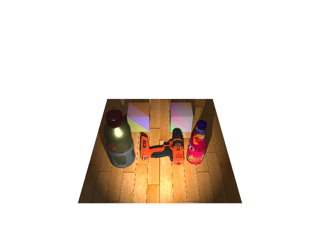
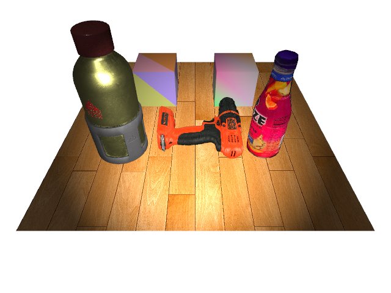

Example Usage
=============

Here is an example of rendering a few objects in a scene.

Preamble
~~~~~~~~

Simple imports, nothing special here.

.. code-block:: python

   import os
   import numpy as np
   import trimesh

   from pyrender import PerspectiveCamera,\
                        DirectionalLight, SpotLight, PointLight,\
                        MetallicRoughnessMaterial,\
                        Primitive, Mesh, Node, Scene,\
                        Viewer, OffscreenRenderer

Creating Meshes from Trimeshes
~~~~~~~~~~~~~~~~~~~~~~~~~~~~~~
You can create `Mesh` objects from `trimesh.Trimesh` objects using
the `Mesh.from_trimesh` function.

.. code-block:: python

   # Fuze trimesh
   fuze_trimesh = trimesh.load('./models/fuze.obj', process=False)
   fuze_mesh = Mesh.from_trimesh(fuze_trimesh)

   # Drill trimesh
   drill_trimesh = trimesh.load('./models/drill.obj', process=False)
   drill_mesh = Mesh.from_trimesh(drill_trimesh)
   drill_pose = np.eye(4)
   drill_pose[0,3] = 0.1
   drill_pose[2,3] = -np.min(drill_trimesh.vertices[:,2])

   # Wood trimesh
   wood_trimesh = trimesh.load('./models/wood.obj', process=False)
   wood_mesh = Mesh.from_trimesh(wood_trimesh)

   # Water bottle trimesh
   bottle_gltf = trimesh.load('./models/WaterBottle.glb', process=False)
   bottle_trimesh = bottle_gltf.geometry[list(bottle_gltf.geometry.keys())[0]]
   bottle_mesh = Mesh.from_trimesh(bottle_trimesh)
   bottle_pose = np.array([
      [1.0, 0.0,  0.0, 0.1],
      [0.0, 0.0, -1.0, -0.16],
      [0.0, 1.0,  0.0, 0.13],
      [0.0, 0.0,  0.0, 1.0],
   ])

Creating Meshes with Per-Vertex or Per-Face Colors
~~~~~~~~~~~~~~~~~~~~~~~~~~~~~~~~~~~~~~~~~~~~~~~~~~
You can also create meshes with per-face or per-vertex coloration.

.. code-block:: python

   #------------------------------------------------------------------------------
   # Creating meshes with per-vertex colors
   #------------------------------------------------------------------------------
   boxv_trimesh = trimesh.creation.box(extents=0.1*np.ones(3))
   boxv_vertex_colors = np.random.uniform(size=(boxv_trimesh.vertices.shape))
   boxv_trimesh.visual.vertex_colors = boxv_vertex_colors
   boxv_mesh = Mesh.from_trimesh(boxv_trimesh, smooth=False)

   #------------------------------------------------------------------------------
   # Creating meshes with per-face colors
   #------------------------------------------------------------------------------
   boxf_trimesh = trimesh.creation.box(extents=0.1*np.ones(3))
   boxf_face_colors = np.random.uniform(size=boxf_trimesh.faces.shape)
   boxf_trimesh.visual.face_colors = boxf_face_colors
   boxf_mesh = Mesh.from_trimesh(boxf_trimesh, smooth=False)

Creating Meshes from Point Clouds
~~~~~~~~~~~~~~~~~~~~~~~~~~~~~~~~~
You can also create meshes from point clouds, with per-point colors optionally
specified.

.. code-block:: python

   points = trimesh.creation.icosphere(radius=0.05).vertices
   points_mesh = Mesh.from_points(points)

Creating Lights
~~~~~~~~~~~~~~~
Creating lights is easy! Read the API documentation for more details.

.. code-block:: python

   direc_l = DirectionalLight(color=np.ones(3), intensity=1.0)
   spot_l = SpotLight(color=np.ones(3), intensity=10.0,
                     innerConeAngle=np.pi/16, outerConeAngle=np.pi/6)
   point_l = PointLight(color=np.ones(3), intensity=10.0)

Creating Cameras
~~~~~~~~~~~~~~~~
Creating cameras is also easy! Perspective cameras are typical for viewing
applications.

.. code-block:: python

   cam = PerspectiveCamera(yfov=(np.pi / 3.0))
   cam_pose = np.array([
      [0.0,  -np.sqrt(2)/2, np.sqrt(2)/2, 0.5],
      [1.0, 0.0,           0.0,           0.0],
      [0.0,  np.sqrt(2)/2,  np.sqrt(2)/2, 0.4],
      [0.0,  0.0,           0.0,          1.0]
   ])

Creating a Scene
~~~~~~~~~~~~~~~~
Once you've created all your meshes, cameras, and lights, you can create a scene
and add objects to it.

.. code-block:: python

   scene = Scene(ambient_light=np.array([0.02, 0.02, 0.02]))

Adding Objects to a Scene
~~~~~~~~~~~~~~~~~~~~~~~~~
You can add objects either by creating a `Node` for each and then adding that or
by using the scene's `add()` utility function directly.

.. code-block:: python

   #------------------------------------------------------------------------------
   # Manually creating nodes
   #------------------------------------------------------------------------------
   fuze_node = Node(mesh=fuze_mesh, translation=np.array([0.1, 0.15, -np.min(fuze_trimesh.vertices[:,2])]))
   scene.add_node(fuze_node)
   boxv_node = Node(mesh=boxv_mesh, translation=np.array([-0.1, 0.10, 0.05]))
   scene.add_node(boxv_node)
   boxf_node = Node(mesh=boxf_mesh, translation=np.array([-0.1, -0.10, 0.05]))
   scene.add_node(boxf_node)

   #------------------------------------------------------------------------------
   # Using the add() utility function
   #------------------------------------------------------------------------------
   drill_node = scene.add(drill_mesh, pose=drill_pose)
   bottle_node = scene.add(bottle_mesh, pose=bottle_pose)
   wood_node = scene.add(wood_mesh)
   direc_l_node = scene.add(direc_l, pose=cam_pose)
   spot_l_node = scene.add(spot_l, pose=cam_pose)

Using Viewer with Default Camera
~~~~~~~~~~~~~~~~~~~~~~~~~~~~~~~~
If the scene doesn't have a camera, a default one will be provided.
Calling the `Viewer()` constructor automatically pops a viewer window.

.. code-block:: python

   v = Viewer(scene, shadows=True)

Using Viewer with Scene Camera
~~~~~~~~~~~~~~~~~~~~~~~~~~~~~~
If the scene has a camera, that camera will be initially used by the viewer.

.. code-block:: python

   cam_node = scene.add(cam, pose=cam_pose)
   v = Viewer(scene, central_node=drill_node)

Offscreen Rendering
~~~~~~~~~~~~~~~~~~~
Finally, you have the option to render things offscreen.
Note that doing so without a display manager and a screen
requires you to install `OSMesa` and prepend any Python execution
with `PYOPENGL_PLATFORM=osmesa`. For example,
`PYOPENGL_PLATFORM=osmesa python my_script.py`.
If you have a screen, you can omit this step, and `pyrender` will just
pop an invisible window to render into.

.. code-block:: python

   r = OffscreenRenderer(viewport_width=640*2, viewport_height=480*2)
   color, depth = r.render(scene)
   r.delete()

   import matplotlib.pyplot as plt
   plt.figure()
   plt.imshow(color)
   plt.show()

.. image:: v3.png

